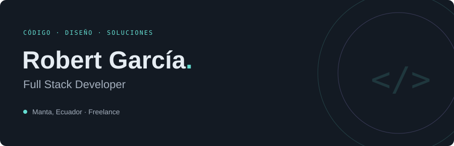
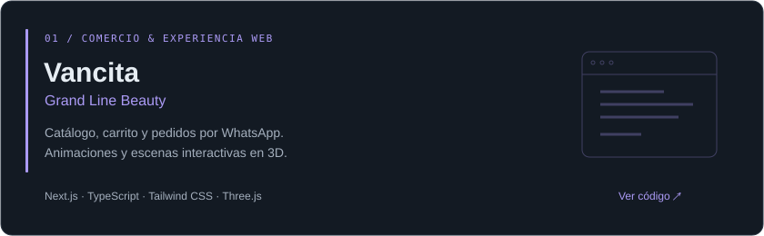
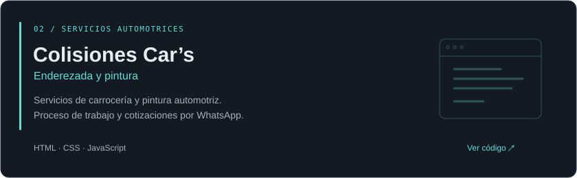

  

Construyo **experiencias web con interfaces cuidadas y código limpio**. Me interesan el desarrollo web moderno, el diseño de interfaces y las soluciones que pueden crecer.

  
  
  

## Proyectos destacados

  

  

  

## Mi caja de herramientas

Tecnologías y herramientas que utilizo y con las que he trabajado.

**Frontend**

**Backend**

**Bases de datos**

**Herramientas**

## En construcción constante

Actualmente construyendo proyectos y aprendiendo nuevas formas de crear mejores experiencias web.

